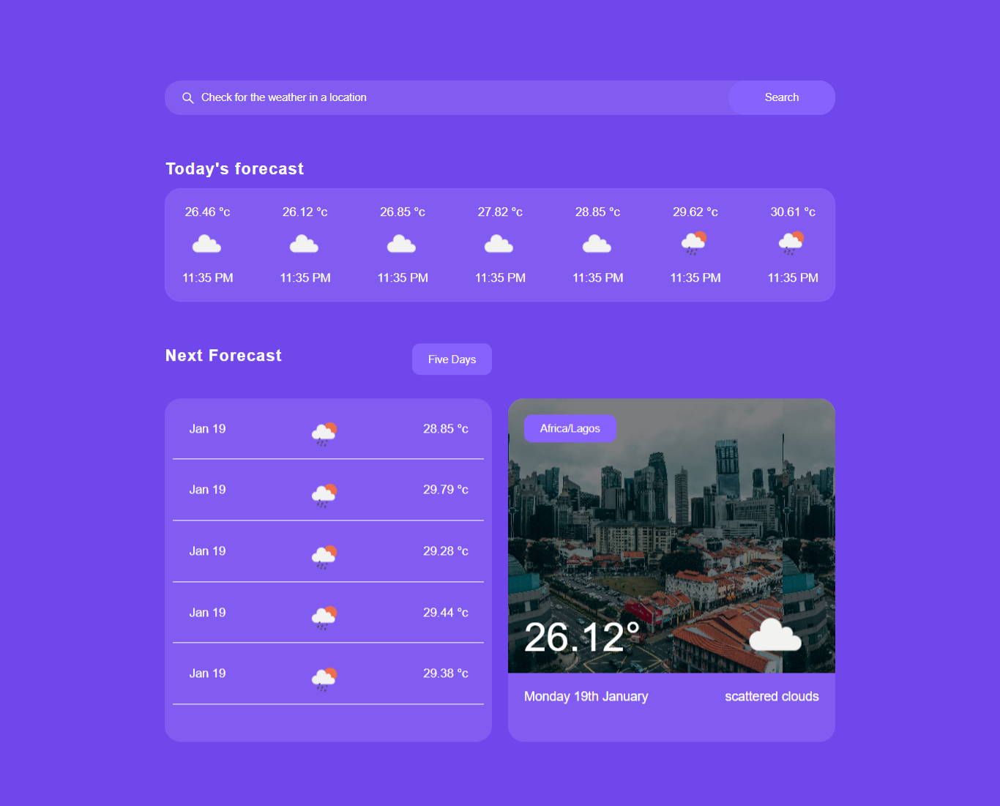
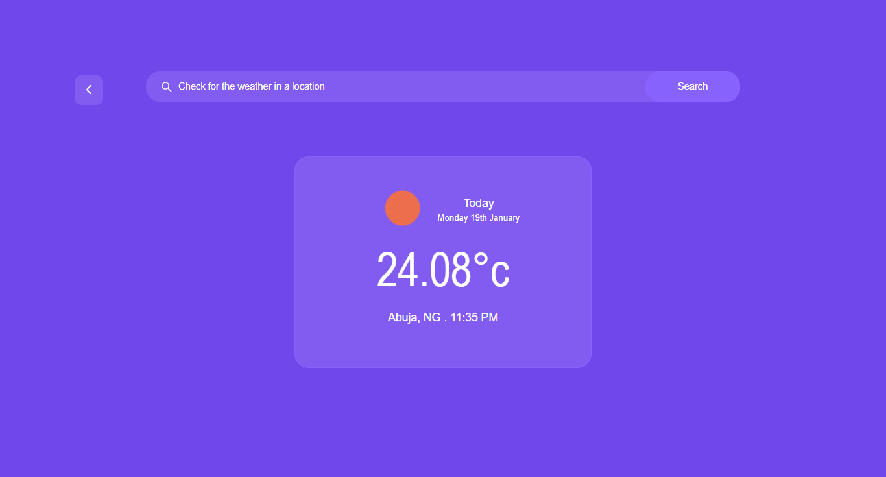

# SOFTPRISM - REACT.JS DEVELOPER RECRUITMENT TASK

## The Challenge

You’re required to develop a weather app off the design provided here using React.

REQUIREMENTS

Pixel Perfect Replication of the design.

- Proficient usage of styled components.
- Comment your code.
- Demonstrate StateManagement Skills.
- API integration from [openweathermap](https://openweathermap.org/)

---

## Screenshot

`Dashboard`



`Search screen`



### Links

- Live Solution URL: [weather app](https://urweather.netlify.app/)

### Notable codeblocks

>`Get user's current location and puts it in state`

```javascript
navigator.geolocation.getCurrentPosition((position) => {
  setLat(position.coords.latitude);
  setLng(position.coords.longitude);
});
```

>`Fetches weather report based on user location`

```javascript
const fetchWeatherData = async () => {
  const res = await axios.get(
    `https://api.openweathermap.org/data/2.5/onecall?lat=${lat}&lon=${lng}&exclude=minutely&appid=${apikey}&units=metric`
  );
  const data = await res.data;
  setTodayForecast(data);
  setIsLoading(false);
};
```

>`Fetches weather report based on search query`

```javascript
const getQuery = async (city) => {
  setIsLoading(true);
  const res = await axios.get(
    `https://api.openweathermap.org/data/2.5/weather?q=${city}&appid=${apikey}&units=metric`
  );
  const data = await res.data;
  console.log(data);
  setSearch(data);
  setIsLoading(false);
};
```

### Built with
- Flexbox
- [React](https://reactjs.org/) - JS library
- [React Context API](https://reactjs.org/docs/context.html) - For state management
- [Styled Components](https://styled-components.com/) - For styles
- [Moment.js](https://momentjs.com/) - For date formatting

